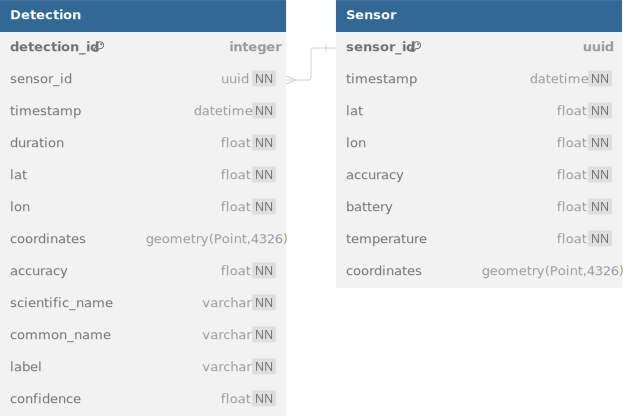

# Upcycled Phone Sensors: Reusing old smartphones for acoustic monitoring

This repository contains the backend code for the project "Upcycled Phone Sensors". The project aims to reuse old smartphones for acoustic monitoring with [BirdNET](https://birdnet.cornell.edu/).

## Project Overview

This project aims to provide a solution for reusing old smartphones for acoustic monitoring.

The project consists of two main components:

1. [**Android App**](https://github.com/rjwc1/eardrum): An Android app that records audio clips and uploads them to the server for processing.
2. **Server** (this repo): A backend server that processes the audio clips using BirdNET and stores the results in a database.


## Technical Overview

This project is developed using the following technologies:

- **Web Framework**: [FastAPI](https://fastapi.tiangolo.com/)
- **Database**: [PostgreSQL](https://www.postgresql.org/) with [PostGIS](https://postgis.net/) extension for geospatial data
- **ORM**: [SQLModel](https://sqlmodel.tiangolo.com/) for defining the database schema and integrating with FastAPI
- **Containerization**: [Docker](https://www.docker.com/) and [Docker Compose](https://docs.docker.com/compose/) for deployment

## Database Schema



## Deployment

### Prerequisites

- [Docker](https://www.docker.com/)
- [Docker Compose](https://docs.docker.com/compose/)

### Deploy with Docker Compose

1. Clone the repository:

```sh
git clone https://github.com/Microwave-WYB/phone-sensors.git
```

2. To deploy with default settings, you do not need any `.env` files, please mke sure you delete any existing `.env` files, unless you want to override the default settings.

3. Start the services using Docker Compose:

```sh
docker-compose up -d
```

This will start all required services. The API server will be available at `http://localhost:8000`.

### Job Management with Redis Queue

This project uses [Redis Queue](https://python-rq.org/) for job management. The job queue is used for processing audio files uploaded by users. By default, the server container will launch one worker process to process jobs from the queue.

To scale the number of worker processes, you can specify the number of worker processes using the `PS_NUM_WORKERS` environment variable in the `.env` file. For example, to start 3 worker processes:

```sh
PS_NUM_WORKERS=3
```

To monitor the job queue, you can use the RQ Dashboard hosted at `http://localhost:8000/rq`.

## Development

### Prerequisites

- [Docker](https://www.docker.com/)
- [Docker Compose](https://docs.docker.com/compose/)
- Python >= 3.11 (3.12 recommended)
- [Poetry](https://python-poetry.org/) for dependency management

### Setup

1. Clone the repository:

```sh
git clone https://github.com/Microwave-WYB/phone-sensors.git
```

2. Create a virtual environment (Optional):

```sh
poetry env use 3.12 # or 3.11
```

3. Install the dependencies:

```sh
poetry install --no-root
```

### Managing dependencies

This project uses [Poetry](https://python-poetry.org/) for dependency management. To add a new dependency, run:

```sh
poetry add <package-name>

# or, to add to a specific group
poetry add --dev <package-name>
```

To remove a dependency, run:

```sh
poetry remove <package-name>
```

You should commit both `pyproject.toml` and `poetry.lock` files after making changes to the dependencies.

To bump the release version of the project, run:

```sh
poetry version <major|minor|patch>
```

### Debugging the server

To run the server locally, you will still need the database and redis server running. You can start the database and redis server using Docker Compose:

```sh
docker-compose up -d db redis pgadmin
```

Then, create a `.env` file or copy from `.env.example` and set the environment variables:

```sh
cp .env.example .env
```

Take a look at the `.env` file copied, make sure you uncomment the variables under `# Development:` for local development.

Finally, run the server:

```sh
poetry run python main.py
```

This should start the server at `http://localhost:8000`. You may specify a different port by setting the `PORT` environment variable in the `.env` file.

### Before you push any changes:

You must aim to pass all of the following checks before pushing any changes. Failing to do so will result in the CI pipeline failing.

1. Run the tests:

```sh
poetry run pytest
```

2. Format the code:

```sh
poetry run black phone_sensors
```

3. Check for typing:

```sh
poetry run pyright phone_sensors
```

4. Check for linting:

```sh
poetry run pylint --rcfile=pylintrc phone_sensors
```
